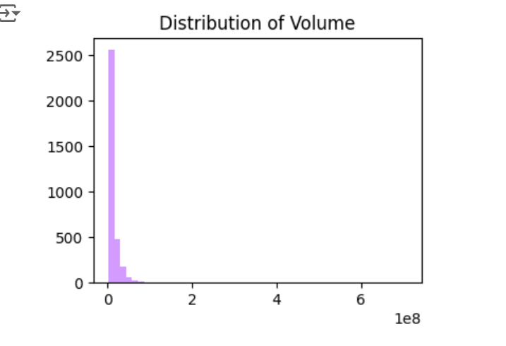

# VISA Market Trend Forecast
This project leverages simple machine learning techniques to analyze and forecast market trends for VISA stock. Using historical price and volume data, I developed a predictive model with hyperparameter tuning through Grid Search to enhance trend prediction accuracy. The implementation includes a comprehensive data preprocessing pipeline and model evaluation, such as Decision Tree and Random Forest, ensuring reliable and precise outcomes. 

## Table of Contents
1. [Dataset](#dataset)
2. [Data Exploration](#data-exploration)
3. [Feature Engineering](#feature-engineering)
4. [Data Preprocessing](#data-preprocessing)
5. [Model Selection and Training](#model-selection-and-training)
6. [Model Optimization](#model-optimization)
7. [Evaluation](#evaluation)
8. [Conclusion](#conclusion)

---

## Dataset
The dataset contains historical stock prices for VISA from 2008 to 2024. It includes the following features:
- **Date**: Trading date
- **Open**: Opening price
- **High**: Highest price of the day
- **Low**: Lowest price of the day
- **Close**: Closing price
- **Adj Close**: Adjusted closing price
- **Volume**: Number of shares traded

---

The dataset was downloaded from Kaggle using the `kagglehub` library.

### Code to Load the Dataset:
```python
import kagglehub
path = kagglehub.dataset_download("umerhaddii/visa-stock-data-2024")
```
---

## Data Exploration
We began by exploring the dataset to understand its structure and characteristics.

### Dataset Overview:
```python
df.info()
df.describe()
df.head()
```

### Statistical Summary:


Insights:
- **Volume** is highly skewed.
- Prices (Open, High, Low, Close) are closely correlated.

---

## Feature Engineering
To enhance prediction, we created the following features:
- **High-Low**: Difference between the highest and lowest price of the day.
- **Close-Open**: Difference between the closing and opening prices.
- **Trend**: Binary feature indicating if the next day’s closing price is higher than the current day’s.

We also eliminated redundant features to simplify the dataset.

---

## Data Preprocessing
Data preprocessing focused on handling **missing values** and addressing **skewness** in certain features.

- Logarithmic transformation was applied to reduce skewness in features like **Volume** and **High-Low**.

- Missing values were imputed using median values to maintain dataset consistency.

This step ensured the data was ready for machine learning models, providing a balanced and normalized input.

---

## Model Selection and Training

### Linear Regression:
The initial model was linear regression, but it performed poorly for binary predictions.

### Decision Tree:
A decision tree regressor improved the accuracy significantly.

### Random Forest:
Further improvement was achieved using a Random Forest Regressor.

### Code:
```python
from sklearn.ensemble import RandomForestRegressor
rforest_reg = make_pipeline(preprocessing, RandomForestRegressor(random_state=42))
rforest_reg.fit(train_copy, y_train)
```
---

## Model Optimization
The Random Forest model was optimized using Grid Search, a systematic method to identify the best combination of hyperparameters. Key parameters tuned included:

- Number of trees

- Maximum tree depth

- Minimum samples per split and leaf

This optimization reduced errors and enhanced model reliability.

### Best Parameters:
```python
{
    'random_forest__max_depth': 10,
    'random_forest__min_samples_leaf': 1,
    'random_forest__min_samples_split': 10,
    'random_forest__n_estimators': 150
}
```

### Code:
```python
from sklearn.model_selection import GridSearchCV
grid_search = GridSearchCV(full_pipeline, param_grid, cv=10, scoring='neg_root_mean_squared_error', n_jobs=-1)
grid_search.fit(train_copy, y_train)
```
---

## Evaluation

### Test Set Performance:
The final model was evaluated on a test set, achieving a Root Mean Square Error (RMSE) of **0.426**. This indicates strong predictive performance, making it suitable for identifying stock market trends.


---

## Conclusion
This project demonstrates the process of building and optimizing a machine learning model for stock trend prediction. Random Forest emerged as the best-performing model after optimization. Future work could include:
- Incorporating additional financial indicators.
- Experimenting with deep learning models.

Feel free to explore the code and extend the project!

---

## How to Run
1. Clone the repository.
2. Install dependencies: `pip install -r requirements.txt`
3. Run the notebook or script in your preferred environment.
4. Check `images` folder for visualizations.

---

## Contact

For questions or suggestions, feel free to reach out via the project’s GitHub issues section.

